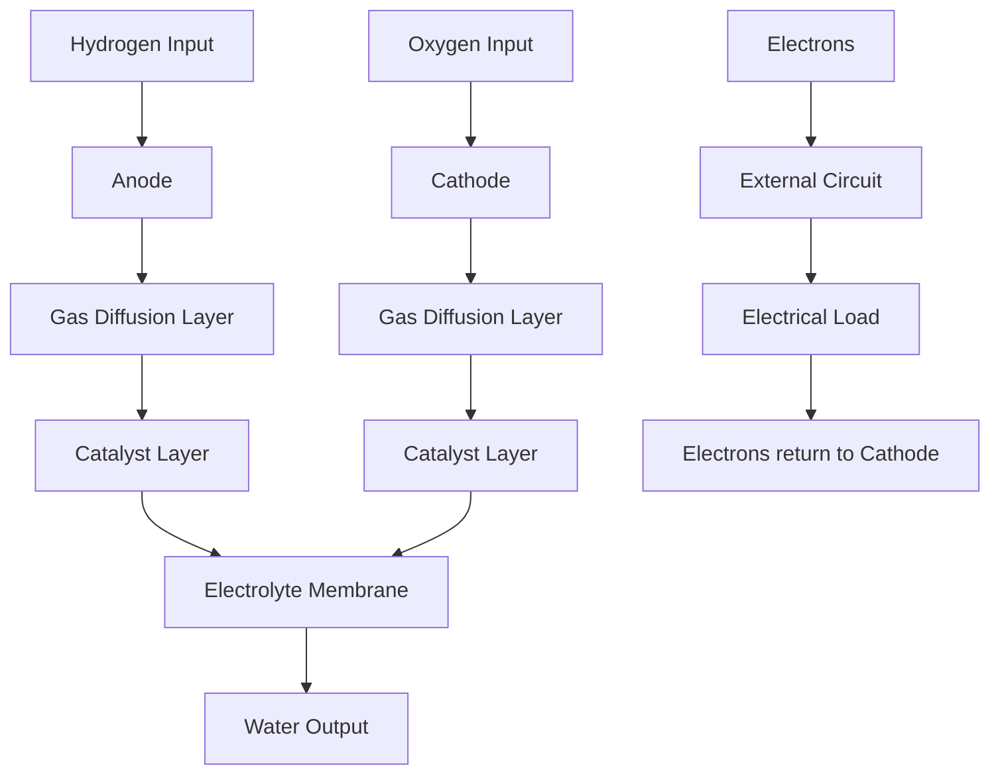

# Fuel Cells: Powering the Future

## Introduction

Fuel cells represent a revolutionary technology in the field of clean energy production. These electrochemical devices convert chemical energy from fuel directly into electricity through a chemical reaction, typically involving hydrogen and oxygen. The concept of fuel cells dates back to the 19th century, but their practical application has seen significant advancements in recent decades.

The principle of the fuel cell was first demonstrated by Sir William Grove in 1839. However, it wasn't until the mid-20th century that fuel cells began to receive serious attention for practical applications. One of the most notable early uses of fuel cells was in NASA's space programs, particularly the Apollo missions of the 1960s and 1970s. Fuel cells provided a reliable and efficient power source for spacecraft, supplying both electricity and drinking water as a byproduct.

Since then, fuel cell technology has continued to evolve, finding applications in various fields from transportation to stationary power generation. Today, as the world seeks cleaner alternatives to fossil fuels, fuel cells are at the forefront of the green energy revolution.

## Principle

The fundamental principle of a fuel cell is based on the electrochemical reaction between a fuel (usually hydrogen) and an oxidant (usually oxygen) that produces electricity, water, and heat. This process is essentially the reverse of electrolysis.

The reactions that occur in a hydrogen fuel cell are as follows:

1. **Anode Reaction**: At the anode, hydrogen gas (H₂) is oxidized to produce protons (H⁺) and electrons (e⁻).

   \[
   \text{2H}_2 \rightarrow \text{4H}^+ + \text{4e}^-
   \]

2. **Cathode Reaction**: At the cathode, oxygen (O₂) is reduced by the incoming electrons and the protons that have traveled through the electrolyte.

   \[
   \text{O}_2 + \text{4H}^+ + \text{4e}^- \rightarrow 2\text{H}_2\text{O}
   \]

The overall reaction for a hydrogen fuel cell is:

\[
\text{2H}_2 + \text{O}_2 \rightarrow 2\text{H}_2\text{O} + \text{Electricity} + \text{Heat}
\]

This reaction produces electricity with water and heat as byproducts, making fuel cells an environmentally friendly power source.

## Working

A fuel cell operates by maintaining a continuous supply of fuel and oxidant. The main components of a fuel cell include:

1. **Anode**: The electrode where oxidation occurs.
2. **Cathode**: The electrode where reduction takes place.
3. **Electrolyte**: A medium that allows the flow of ions between the anode and cathode but blocks electrons.
4. **External Circuit**: Allows the flow of electrons from the anode to the cathode, generating electricity.

### Steps of Operation

1. **Fuel Supply**: Hydrogen is fed into the anode side, while oxygen (from air) is fed into the cathode side.
2. **Ion and Electron Flow**: Hydrogen molecules are split into protons and electrons at the anode. The electrons flow through an external circuit, providing electrical power, while protons move through the electrolyte to the cathode.
3. **Recombination**: At the cathode, protons, electrons, and oxygen combine to form water and heat.

### Detailed Explanation of Fuel Cell Parts

#### 1. Anode

The anode is the negative electrode of the fuel cell. It's typically made from a porous carbon material coated with a platinum catalyst. The porosity allows for efficient distribution of the hydrogen gas, while the platinum catalyst facilitates the splitting of hydrogen molecules into protons and electrons.

Key features of the anode:
- Porous structure for gas diffusion
- Platinum catalyst for hydrogen oxidation
- Conductive material for electron collection

#### 2. Cathode

The cathode is the positive electrode where oxygen reduction occurs. Like the anode, it's usually made from porous carbon with a platinum catalyst. The catalyst at the cathode facilitates the combination of oxygen with protons and electrons to form water.

Key features of the cathode:
- Porous structure for oxygen diffusion
- Platinum catalyst for oxygen reduction
- Conductive material for electron distribution

#### 3. Electrolyte

The electrolyte is a crucial component that separates the anode and cathode. In many modern fuel cells, particularly Proton Exchange Membrane (PEM) fuel cells, the electrolyte is a solid polymer membrane. This membrane allows protons to pass through while blocking electrons and gases.

Key features of the electrolyte:
- Proton conductivity
- Electrical insulation
- Gas impermeability

#### 4. Gas Diffusion Layers

These layers are placed between the electrodes and the flow field plates. They ensure even distribution of reactant gases across the catalyst surfaces and help manage water within the cell.

Key features of gas diffusion layers:
- Porous carbon material
- Hydrophobic treatment for water management
- Electrical conductivity

#### 5. Flow Field Plates

These plates have channels etched into them to distribute gases evenly across the electrodes. They also serve as current collectors and provide structural support to the cell.

Key features of flow field plates:
- Conductive material (often graphite or metal)
- Channel design for efficient gas distribution
- Structural support for the cell

#### 6. Cooling System

As fuel cells generate heat during operation, a cooling system is necessary to manage temperature. This can be as simple as air cooling for small cells or a liquid cooling system for larger applications.

### Labeled Diagram of a Fuel Cell

## Types of Fuel Cells

There are several types of fuel cells, each with unique characteristics and applications:

1. **Proton Exchange Membrane (PEM) Fuel Cells**: These use a solid polymer as an electrolyte and operate at relatively low temperatures (80°C). They are commonly used in vehicles and portable applications.

2. **Solid Oxide Fuel Cells (SOFCs)**: These operate at high temperatures (800-1000°C) and can use a variety of fuels. They are often used for stationary power generation.

3. **Molten Carbonate Fuel Cells (MCFCs)**: These high-temperature fuel cells (650°C) are suitable for large-scale, stationary power generation.

4. **Phosphoric Acid Fuel Cells (PAFCs)**: These operate at medium temperatures (200°C) and are often used for stationary power generation in buildings.

5. **Alkaline Fuel Cells (AFCs)**: These were one of the first fuel cell technologies developed and were used in the Apollo space program. They operate at 60-70°C.

## Advantages

- **High Efficiency**: Fuel cells have higher efficiency compared to traditional combustion engines, converting more energy from fuel into electricity.
- **Environmentally Friendly**: The only byproducts are water and heat, producing zero harmful emissions.
- **Quiet Operation**: Fuel cells operate silently, making them suitable for various applications, including residential and portable power systems.
- **Scalability**: Fuel cells can be scaled for small applications (like portable electronics) to larger installations (like power plants).
- **Continuous Operation**: As long as fuel is supplied, fuel cells can operate continuously, unlike batteries which need recharging.

## Applications

Fuel cells are versatile and can be used in various applications, including:

1. **Transportation**: Fuel cell vehicles (FCVs) use hydrogen fuel cells to power electric motors, offering a cleaner alternative to gasoline and diesel vehicles.

   

2. **Stationary Power Generation**: Fuel cells can provide backup power for homes and businesses, or be integrated into renewable energy systems.

   

3. **Portable Power**: Fuel cells are used in portable electronics, providing longer run times compared to batteries.

   

4. **Aerospace Applications**: Fuel cells are used in spacecraft and drones for power due to their high energy density and reliability.

   

## Challenges and Future Developments

Despite their advantages, fuel cells face several challenges:

1. **Cost**: The use of precious metal catalysts like platinum makes fuel cells expensive.
2. **Hydrogen Infrastructure**: The lack of widespread hydrogen fueling infrastructure limits the adoption of fuel cell vehicles.
3. **Durability**: Improving the longevity of fuel cells, especially in harsh operating conditions, is an ongoing area of research.

Future developments in fuel cell technology are focused on addressing these challenges:

- Research into non-precious metal catalysts to reduce costs
- Development of more efficient hydrogen production and storage methods
- Improvements in fuel cell durability and performance
- Integration with renewable energy sources for sustainable hydrogen production

## Conclusion

Fuel cells represent a promising technology for the future of clean energy. Their high efficiency, minimal environmental impact, and versatility make them an attractive option for a wide range of applications. As research and development continue, we can expect to see broader applications and improvements in fuel cell technology, paving the way for a cleaner and more sustainable energy landscape.

As the world moves towards decarbonization and seeks alternatives to fossil fuels, fuel cells are poised to play a crucial role in our energy future. From powering our vehicles to providing reliable backup power for critical infrastructure, fuel cells offer a clean, efficient, and versatile solution to many of our energy needs.
