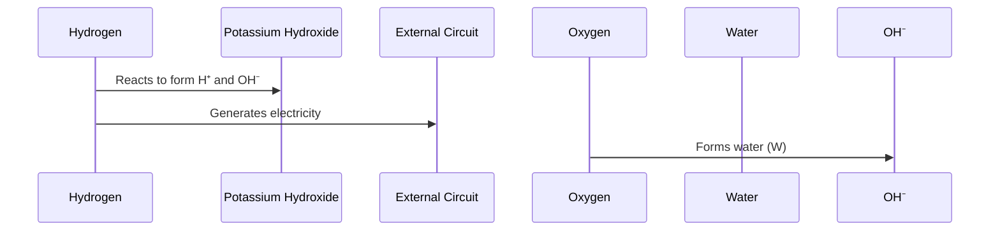

# Background

The story of the fuel cell begins in the early 19th century, with Sir William Grove, a Welsh judge, inventor, and physicist, often credited as the "father of the fuel cell." He built the first crude fuel cell in 1839 in Swansea, Wales, during his experiments with electricity and electrochemical reactions.

His work on the fuel cell was driven by a curiosity about converting chemical energy directly into electrical energy in a cleaner and potentially more efficient way.

> Though Grove’s fuel cell was groundbreaking, it wasn't developed into a practical technology for over a century. The fuel cell gained renewed attention in the 20th century, particularly during the space race, when NASA used them to power spacecraft. Fuel cells are now being explored as a clean energy source, especially in electric vehicles and renewable energy systems.

# Introduction

A fuel cell is an electrochemical device that converts the chemical energy of a fuel, such as hydrogen, directly into electrical energy through redox reactions. 

> Advantages of fuel cell
> - Fuel cells produce only water and heat as byproducts, 
> - have higher energy efficiency than combustion engines,
> - can be powered by renewable hydrogen, reducing greenhouse gas emissions and fossil fuel reliance

## Types of Fuel Cells: There are several types, each using different materials and fuels:

| **Type**                              | **Developed in Year** | **Usage**                                           |
|---------------------------------------|-----------------------|----------------------------------------------------|
| Proton Exchange Membrane Fuel Cell (PEMFC)  | 1960s                | Used in vehicles, portable power, and stationary applications. |
| Solid Oxide Fuel Cell (SOFC)          | 1937                  | Used for stationary power generation and industrial applications. |
| Alkaline Fuel Cell (AFC)              | 1950s                 | Used in space missions (e.g., Apollo) and some military applications. |
| Phosphoric Acid Fuel Cell (PAFC)      | 1960s                 | Used in large stationary power generation. |
| Molten Carbonate Fuel Cell (MCFC)     | 1960s                 | Used for large-scale power plants and industrial applications. |
| Direct Methanol Fuel Cell (DMFC)      | 1990s                 | Used in portable devices and small-scale applications. |

Note: The fuel cell that Sir William Grove developed in 1839 was the Grove cell, which is often considered the first fuel cell. It was a hydrogen-oxygen fuel cell, where hydrogen and oxygen were combined to generate electricity, with water as a byproduct. The cell used platinum electrodes and sulfuric acid as the electrolyte, making it an early precursor to modern fuel cell technologies like the Proton Exchange Membrane Fuel Cell (PEMFC).

# Principle of Fuel Cell

**General Principle**: The core principle is an electrochemical reaction where fuel (usually hydrogen) reacts with an oxidant (usually oxygen) to produce electricity. The general reaction is:

$$
2H_2 + O_2 → 2H_2O + 	ext{electricity} + 	ext{heat}
$$

Here we will discuss about the principle, construction, working of AFC(Alkaline Fuel Cell) first and PEMFC(Proton Exchange Membrane Fuel Cell) with diagrams and images.

> **Apollo Mission Fuel Cell**: The Alkaline Fuel Cell (AFC) was used in the Apollo missions. It operated by using hydrogen and oxygen to produce electricity, water, and heat, with water being consumed by astronauts.

> **Most Common Type**: The Proton Exchange Membrane Fuel Cell (PEMFC) is the most widely used, especially in vehicles. Its working principle involves hydrogen splitting at the anode, electron flow through a circuit, and water formation at the cathode.

# Alkaline Fuel cell (AFC)

{put a marquee here that shows images of apollo fuel cell; ignore if not possible in markdown}

## Principle

In an AFC, hydrogen is oxidized at the anode, generating protons and electrons. The protons move through the electrolyte to the cathode, while the electrons flow through an external circuit, creating electricity. At the cathode, oxygen combines with the protons and electrons to form water as a byproduct, completing the electrochemical cycle.

## Construction

While the stack contains multiple cells, we can understand its function by studying just one cell within this stack. What we're seeing is essentially multiple individual cells stacked together to increase power output, with each cell operating on the principles shown in the theoretical diagram.

| **Part Name**          | **Material**                       | **Function**                                                  | **Location**                                       |
|------------------------|------------------------------------|--------------------------------------------------------------|----------------------------------------------------|
| **Anode**              | Nickel-based catalyst              | - Oxidizes hydrogen - Releases electrons                  | One side of each cell                              |
| **Cathode**            | Nickel-based catalyst              | - Reduces oxygen - Combines with electrons and H⁺ to form water | Opposite side of each cell from anode             |
| **Electrolyte**        | Potassium hydroxide (KOH) solution | - Conducts hydroxide ions between electrodes                 | Between anode and cathode in each cell            |
| **Bipolar Plates**     | Likely graphite or metal           | - Separates individual cells - Conducts electricity - Distributes gases | Between each cell in the stack                     |
| **End Plates**         | Metal (likely aluminum or stainless steel) | - Holds the stack together - Provides electrical connections | At each end of the entire stack                    |
| **Gas Manifolds**      | Durable plastic or metal           | - Distributes hydrogen and air to each cell                  | Visible as ports on the sides of the stack         |
| **Electrolyte Ports**  | Durable plastic or metal           | - Allows for electrolyte management                          | Visible as additional ports on the stack           |

This table summarizes the components of a single cell within an **Alkaline Fuel Cell Stack**, illustrating how each part contributes to the overall function of the fuel cell while highlighting the materials used in their construction. Each cell operates based on electrochemical principles, while the stack efficiently combines multiple cells to enhance power output, manage gas flow, and maintain structural integrity. 

## Working

### Working of AFC as a whole
.jpg)

Hydrogen enters the cell and reacts with potassium hydroxide (KOH), forming H⁺ and OH⁻ ions. The protons move through the electrolyte, while the electrons flow through the external circuit, generating electricity. At the cathode, the OH⁻ ions react with the incoming oxygen to form water.

### Working of Anode 
- Hydrogen is oxidized at the anode, releasing electrons and generating protons.

### Working of Cathode 
- At the cathode, oxygen combines with protons and electrons to form water.

### Working of Electrolyte 
- The electrolyte allows hydroxide ions to conduct between the anode and cathode.

### Working of Bipolar Plates 
- Bipolar plates separate the cells and facilitate gas distribution.

### Remaining Parts 
- The remaining components work together to manage gas flow and maintain structural integrity.

## Applications of AFC

# PEMFC

The structure will be the same as that of AFC.

# FAQ

1. 

	
 Why is AFC called "alkaline" Fuel Cell?

	The Alkaline Fuel Cell (AFC) is called "alkaline" because it utilizes an alkaline electrolyte, typically a concentrated solution of potassium hydroxide (KOH). This alkaline environment is crucial for facilitating the electrochemical reactions that occur within the cell.

