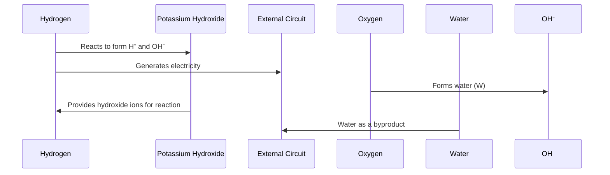

# Background

  
*Sir William Robert Grove, the "father of the fuel cell"*

The story of the fuel cell begins in the early 19th century, with Sir William Grove, a Welsh judge, inventor, and physicist, often credited as the "father of the fuel cell." He built the first crude fuel cell in 1839 in Swansea, Wales, during his experiments with electricity and electrochemical reactions.

His work on the fuel cell was driven by a curiosity about converting chemical energy directly into electrical energy in a cleaner and potentially more efficient way.

*Diagram of the original Grove cell, the first fuel cell*

> Though Grove's fuel cell was groundbreaking, it wasn't developed into a practical technology for over a century. The fuel cell gained renewed attention in the 20th century, particularly during the space race, when NASA used them to power spacecraft. Fuel cells are now being explored as a clean energy source, especially in electric vehicles and renewable energy systems.

# Introduction

A fuel cell is an electrochemical device that converts the chemical energy of a fuel, such as hydrogen, directly into electrical energy through redox reactions. 

> Advantages of fuel cell
> - Fuel cells produce only water and heat as byproducts, 
> - have higher energy efficiency than combustion engines,
> - can be powered by renewable hydrogen, reducing greenhouse gas emissions and fossil fuel reliance

## Types of Fuel Cells: There are several types, each using different materials and fuels:

| **Type**                              | **Developed in Year** | **Usage**                                           |
|---------------------------------------|-----------------------|----------------------------------------------------|
| Proton Exchange Membrane Fuel Cell (PEMFC)  | 1960s                | Used in vehicles, portable power, and stationary applications. |
| Solid Oxide Fuel Cell (SOFC)          | 1937                  | Used for stationary power generation and industrial applications. |
| Alkaline Fuel Cell (AFC)              | 1950s                 | Used in space missions (e.g., Apollo) and some military applications. |
| Phosphoric Acid Fuel Cell (PAFC)      | 1960s                 | Used in large stationary power generation. |
| Molten Carbonate Fuel Cell (MCFC)     | 1960s                 | Used for large-scale power plants and industrial applications. |
| Direct Methanol Fuel Cell (DMFC)      | 1990s                 | Used in portable devices and small-scale applications. |

Note: The fuel cell that Sir William Grove developed in 1839 was the Grove cell, which is often considered the first fuel cell. It was a hydrogen-oxygen fuel cell, where hydrogen and oxygen were combined to generate electricity, with water as a byproduct. The cell used platinum electrodes and sulfuric acid as the electrolyte, making it an early precursor to modern fuel cell technologies like the Proton Exchange Membrane Fuel Cell (PEMFC).

# Principle of Fuel Cell

**General Principle**: The core principle is an electrochemical reaction where fuel (usually hydrogen) reacts with an oxidant (usually oxygen) to produce electricity. The general reaction is:

$$
2H_2 + O_2 → 2H_2O + 	ext{electricity} + 	ext{heat}
$$

Here we will discuss about the principle, construction, working of AFC(Alkaline Fuel Cell) first and PEMFC(Proton Exchange Membrane Fuel Cell) with diagrams and images.

> **Apollo Mission Fuel Cell**: The Alkaline Fuel Cell (AFC) was used in the Apollo missions. It operated by using hydrogen and oxygen to produce electricity, water, and heat, with water being consumed by astronauts.

> **Most Common Type**: The Proton Exchange Membrane Fuel Cell (PEMFC) is the most widely used, especially in vehicles. Its working principle involves hydrogen splitting at the anode, electron flow through a circuit, and water formation at the cathode.

# Alkaline Fuel Cell (AFC)

  
*Alkaline fuel cell used in Apollo-11 space mission in 1969*

> The bottom cylindrical part is the fuel cell as described in the below image:
> 

## Principle
Works on the principle of redox reaction. In an Alkaline Fuel Cell (AFC), hydrogen is oxidized at the anode, generating protons and electrons.  
  
*An actual 500W output AFC*

The reactions occurring at each electrode are as follows:

### Reactions
- **At the Anode:**
  \[
  2H_2 \rightarrow 4H^+ + 4e^-
  \]
  Hydrogen gas is oxidized, producing protons and electrons.

- **At the Cathode:**
  \[
  O_2 + 4H^+ + 4e^- \rightarrow 2H_2O
  \]
  Oxygen gas combines with protons and electrons to form water.

- **Overall Reaction:**
  \[
  2H_2 + O_2 \rightarrow 2H_2O + \text{Electricity} + \text{Heat}
  \]

The protons move through the electrolyte to the cathode, while the electrons flow through an external circuit, creating electricity. At the cathode, oxygen combines with the protons and electrons to form water as a byproduct, thus completing the electrochemical cycle.

## Construction

While the stack contains multiple cells, we can understand its function by studying a single cell within this stack. Each cell operates on electrochemical principles, with multiple individual cells stacked together to increase power output.

| **Part Name**          | **Material**                       | **Function**                                                  | **Location**                                       |
|------------------------|------------------------------------|--------------------------------------------------------------|----------------------------------------------------|
| **Anode**              | Nickel-based catalyst              | - Oxidizes hydrogen - Releases electrons                  | One side of each cell                              |
| **Cathode**            | Nickel-based catalyst              | - Reduces oxygen - Combines with electrons and H⁺ to form water | Opposite side of each cell from anode             |
| **Electrolyte**        | Potassium hydroxide (KOH) solution | - Conducts hydroxide ions between electrodes                 | Between anode and cathode in each cell            |
| **Bipolar Plates**     | Graphite or metal                  | - Separates cells - Conducts electricity - Distributes gases | Between each cell in the stack                     |
| **End Plates**         | Aluminum or stainless steel        | - Holds the stack together - Provides electrical connections | At each end of the entire stack                    |
| **Gas Manifolds**      | Durable plastic or metal           | - Distributes hydrogen and air to each cell                  | Ports on the sides of the stack                    |
| **Electrolyte Ports**  | Durable plastic or metal           | - Allows for electrolyte management                          | Additional ports on the stack                      |

*The efficient design of the stack combines multiple cells, enhancing power output while effectively managing gas flow and maintaining structural integrity.*

**Additional Facts:**
- AFCs are known for their high efficiency and relatively low operating temperatures (typically around 60-100°C).
- They are widely used in space applications, such as the Apollo missions, due to their reliability and ability to generate clean water as a byproduct.

## Working 

### Working of AFC as a Whole
.jpg)

Hydrogen enters the cell and reacts with potassium hydroxide (KOH), forming H⁺ and OH⁻ ions. The protons move through the electrolyte, while the electrons flow through the external circuit, generating electricity. At the cathode, the OH⁻ ions react with the incoming oxygen to form water.

### Working of Anode 
At the anode, hydrogen undergoes oxidation:

\[
\text{2H}_2 \rightarrow \text{4H}^+ + \text{4e}^-
\]

- **Explanation**: Two molecules of hydrogen gas (\( \text{H}_2 \)) are oxidized to produce four protons (\( \text{H}^+ \)) and four electrons (\( \text{e}^- \)).

### Working of Cathode 
At the cathode, oxygen reacts with protons and electrons to form water:

\[
\text{O}_2 + \text{4H}^+ + \text{4e}^- \rightarrow \text{2H}_2\text{O}
\]

- **Explanation**: One molecule of oxygen (\( \text{O}_2 \)) combines with four protons (\( \text{H}^+ \)) and four electrons (\( \text{e}^- \)) to produce two molecules of water (\( \text{H}_2\text{O} \)).

### Working of Electrolyte 
- The electrolyte allows hydroxide ions to conduct between the anode and cathode.

### Working of Bipolar Plates 
- Bipolar plates separate the cells and facilitate gas distribution.

### Working of End Plates 
- Made from aluminum or stainless steel, the end plates hold the entire stack of cells together. They provide structural support and ensure electrical connections are made at both ends of the stack. Their durability is critical for maintaining the integrity of the assembly under operational conditions.

### Working of Gas Manifolds 
- Constructed from durable plastic or metal, gas manifolds are essential for distributing hydrogen and air (oxygen) evenly to each cell in the stack. They help ensure that each cell receives the necessary reactants for optimal performance, allowing for efficient chemical reactions throughout the fuel cell.

### Working of Electrolyte Ports 
- These ports, made of durable plastic or metal, allow for the management of the electrolyte solution. They enable maintenance and replenishment of the potassium hydroxide (KOH) solution, ensuring that the electrolyte remains at the appropriate levels for optimal ion conductivity and performance.

## Applications of AFC

| **Application**            | **Description**                                                                                                     |
|----------------------------|---------------------------------------------------------------------------------------------------------------------|
| **Space Exploration**      | Used in Apollo missions to provide electricity and drinking water for astronauts.                                  |
| **Backup Power Systems**   | Serves as backup power for critical infrastructure, ensuring continuous operation during outages.                    |
| **Fuel Cell Vehicles**     | Powers electric vehicles, offering a clean alternative to fossil fuels.                                           |
| **Portable Power Generation** | Provides energy in remote locations and emergency situations without fossil fuel reliance.                        |
| **Hydrogen Production**    | Assists in producing hydrogen through electrolysis, contributing to a sustainable hydrogen economy.                  |
| **Marine Applications**    | Used in ships and submarines, offering high efficiency and low emissions for greener maritime transport.            |
| **Military Applications**  | Investigated for use in military equipment due to their quiet and efficient power source.                          |
| **Industrial Power Systems** | Integrated into industrial systems to reduce emissions and improve energy efficiency in various processes.       |

# FAQ

1. 

	
 Why is AFC called "alkaline" Fuel Cell?

	The Alkaline Fuel Cell (AFC) is called "alkaline" because it utilizes an alkaline electrolyte, typically a concentrated solution of potassium hydroxide (KOH). This alkaline environment is crucial for facilitating the electrochemical reactions that occur within the cell.

